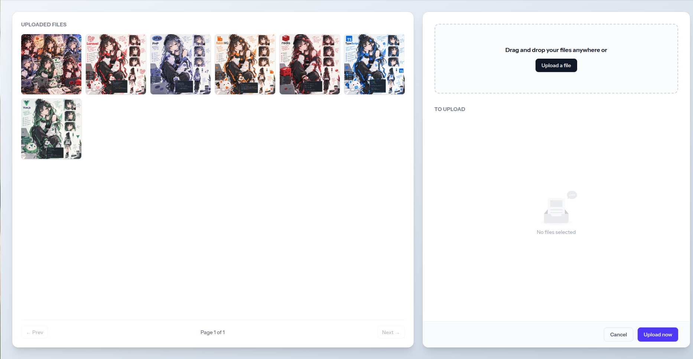

# Laravel Object Storage (Yandex Cloud)



Небольшое Laravel-приложение для загрузки файлов через drag-and-drop форму с сохранением в **Yandex Object Storage** (S3-совместимое хранилище) и постраничным просмотром уже загруженных файлов.

## Возможности

- Drag-and-drop / выбор файлов через кнопку, превью перед отправкой (`resources/js/file-upload.js`, `resources/views/components/file-upload.blade.php`).
- Загрузка файлов (`jpg`, `png`, `webp`, `gif`, до 10 МБ) в бакет Yandex Object Storage через S3-адаптер Laravel.
- Список уже загруженных файлов с постраничной навигацией (`resources/js/get-files.js`, `resources/views/components/file-list.blade.php`).
- Верстка на Tailwind CSS 4: галерея файлов слева (60% ширины), форма загрузки справа (40%).

## Стек

- Laravel 13, PHP 8.3
- `league/flysystem-aws-s3-v3` — S3-совместимый драйвер для `Storage::disk('s3')`
- Vite + Tailwind CSS 4

## Установка

```bash
composer install
npm install

cp .env.example .env
php artisan key:generate
```

## Настройка Yandex Object Storage

В `.env` заполните блок `AWS_*` данными вашего сервисного аккаунта и бакета:

```env
AWS_ACCESS_KEY_ID=<статический ключ сервисного аккаунта>
AWS_SECRET_ACCESS_KEY=<секрет сервисного аккаунта>
AWS_DEFAULT_REGION=ru-central1
AWS_BUCKET=<имя бакета>
AWS_ENDPOINT=https://storage.yandexcloud.net
AWS_USE_PATH_STYLE_ENDPOINT=false
```

Важно:

- Права на запись/чтение бакета нужно выдать **сервисному аккаунту** (роль `editor` на бакете), а не личному аккаунту в консоли — это разные сущности.
- Диск `s3` настроен с `'visibility' => 'public'` (`config/filesystems.php`), поэтому загруженные файлы сразу доступны по прямой ссылке вида `https://<bucket>.storage.yandexcloud.net/<path>`.
- Убедитесь, что переменные `AWS_*` не переопределены на уровне окружения процесса (например, старым запуском `composer dev` из IDE) — переменные окружения ОС имеют приоритет над `.env`.

## Запуск

```bash
composer run dev
```

Поднимет одновременно: `php artisan serve`, очередь, лог-вьюер (`pail`) и Vite dev-сервер. Приложение будет доступно на `http://localhost:8000`.

Для продакшен-сборки фронтенда:

```bash
npm run build
```

## Структура (что относится к загрузке файлов)

```
app/Http/Controllers/ImageController.php   — маршруты upload/index
app/Http/Requests/ImageRequest.php         — валидация файлов (тип, размер)
app/Http/Services/ImageService.php         — запись в S3, постраничный список файлов
resources/views/components/file-upload.blade.php — форма загрузки
resources/views/components/file-list.blade.php   — список файлов с пагинацией
resources/js/file-upload.js                — drag&drop, отправка на /files/upload
resources/js/get-files.js                  — загрузка и рендер /files (пагинация)
```
